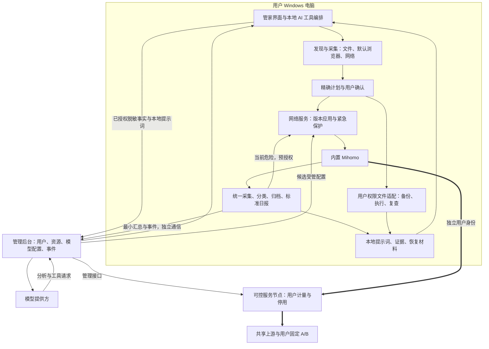
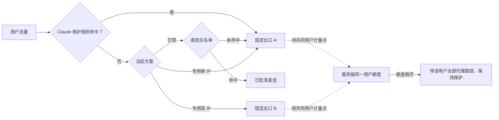
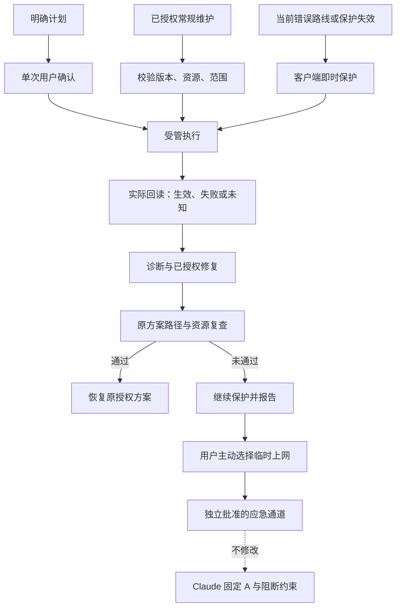
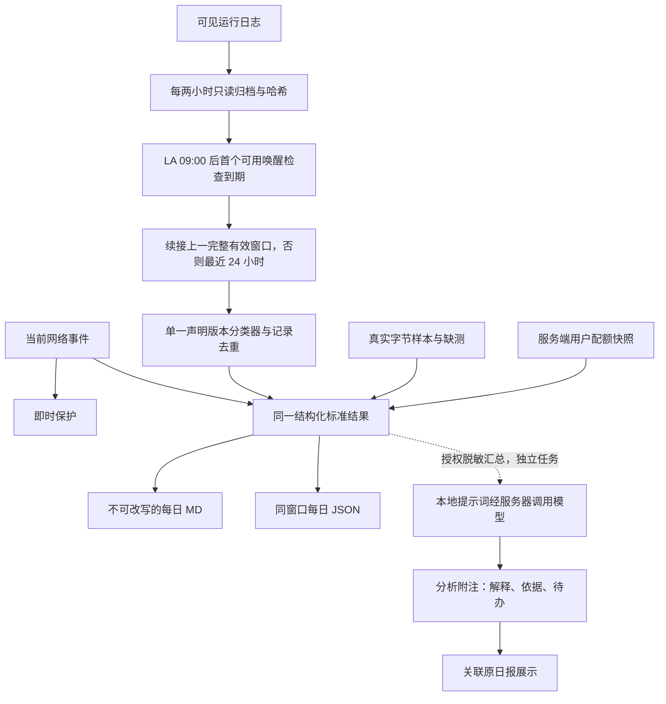

# 系统架构：Claude 环境管理应用

> v1.3 · 2026-09-12。四模块业务边界按 Owner 决定；物理技术选型按复用对照和实测决定。当前没有产品运行证据。

## 1. 结构与唯一责任

建议一个普通权限桌面应用、一个窄权限网络服务、一个内置 Mihomo 进程，以及一个管理后台。桌面在 CVR 裁剪与轻壳两路线间按净改造量选择；网络服务可复用所选底座的适用实现，不另建第二个同职责控制面。前台、AI 编排、文件适配器可在同一桌面程序内；网络服务负责需要提权和 UI 退出后仍须存在的保护。配额优先接供应商原生用户能力，缺口明确后才部署成熟配额组件和受管节点，不按业务模块拆微服务。

| 组件 | 实际职责 | 不拥有的权力 |
|---|---|---|
| 桌面 UI 与本地任务编排 | 范围、扫描、账号回答、AI 工具循环、计划确认、结果、默认浏览器诊断页 | 不自行扩展用户确认范围 |
| 本地文件/浏览器适配器 | 当前用户的有限读取、字段/记录操作、备份、复查 | 不以 LocalSystem 全盘扫描，不执行模型命令字符串 |
| 网络服务 | 托管内核、应用受管配置、保护、恢复、输出实际状态 | 不提供任意文件删除/终端，不把后台消息当任意远控 |
| 内置 Mihomo | TUN、DNS、固定链、白名单、连接与字节观测 | 本机统计不能覆盖服务端配额账目 |
| 共享报告模块 | 一个分类器、字节来源、归档、标准日报与历史保留 | 回放不改网、不发测试流量 |
| 管理后台 | 应用用户、资源分配、模板版本、AI 服务配置、配额适配、最小事件 | 不默认收完整访问历史、Claude 凭据和对话 |
| 模型服务 | 接收脱敏事实与客户端提示词，返回分析和工具请求 | 无直连电脑的终端、无配额和分类修改权 |
| 服务端计量执行点 | 按独立应用用户身份计量与停用全部分配路径 | 不能只统计共享总量或只撤销订阅 URL |

UI 与本地服务通信须绑定当前已登录 Windows 用户，执行层重新校验操作类型与授权。普通文件写入维持用户权限；确需管理员的具体设置由网络/系统适配入口处理。该分工不能把整个模型进程提升成管理员。

## 2. 总体关系

<!-- diagram:01_system_architecture.mmd -->

<!-- /diagram:01_system_architecture.mmd -->

[图源](DOCS/diagrams/01_system_architecture.mmd)。图中计量点是一项逻辑责任：可由供应商原生用户能力提供，也可由受管接入节点提供；尚未证明当前共享订阅支持原生模式。

## 3. AI 与执行数据流

客户端提示词源/工具版本 + 脱敏事实 → 本应用服务器持有的模型配置 → 模型响应 → 客户端校验工具调用 → 受限读取或已确认计划执行 → 实际复查 → AI 解释。

工具调用不是执行成功回执。AI 形成精确计划，用户确认后通过一次本地批量工具调用完成逐项检查、备份、执行和复查，再消费汇总回执。执行计划绑定扫描快照、对象与动作；写前比较目标变化，写后读取真实状态；批处理不能增加未确认对象。计划与恢复事实留在业务记录，不依赖 SDK 会话成为唯一记录。网络修复和自动保护共用受管网络入口，但授权来源不同。服务端不下发任意命令，提示词中的指令不构成操作许可。

模型断开时停止新的模型依赖步骤，标准扫描、已确认的确定性执行、网络保护和本地恢复可继续。AI 的事实引用与推断分开，不能修改评分权重、配额或日志分类。细节见 [接口](DOCS/INTERFACES.md)。

## 4. 网络三方案与计量

<!-- diagram:02_network_modes.mmd -->

<!-- /diagram:02_network_modes.mmd -->

[图源](DOCS/diagrams/02_network_modes.mmd)。图表达最终路由分工，物理链路按服务端接入方案验证。回环、必要局域网与建链通信在模板中明确；不能用宽泛直连规则兜底。

Claude A 故障连接保持阻断；前置资源可替换不意味着 A 轮换。当前个人配置把 chrome.exe 整个进程路由到 Claude 固定链，产品必须把这种范围告诉选择专用浏览器的用户，不声称所有 A 流量都是 Claude 业务。

共享订阅池与个人配额分开。用户身份必须在真实流量节点生效：用户甲耗尽→甲新连接被拒绝且在途连接收尾/断开→乙丙继续。客户端不取得绕过该身份验证点的共享凭据。重新安装或恢复旧配置不能绕过已撤销身份。

计量权威与链路先取得对应 P0 证据，字节口径和发布响应目标据实测明确；[待定决策](DOCS/OPEN_DECISIONS.md)中的建议数值不自动成为上游淘汰门槛。供应商原生能力满足时省去额外节点；需要受管接入节点时，先明确每段协议、凭据与 A/B 同账方式，验证一个用户全链后再验证三用户停用。新增一跳须测全链延迟，不能只看前置节点 ping 或 gstatic 测速。

## 5. 授权、故障和手动应急

<!-- diagram:03_authority_emergency.mmd -->

<!-- /diagram:03_authority_emergency.mmd -->

[图源](DOCS/diagrams/03_authority_emergency.mmd)。

单次处理、首次范围维护授权、紧急保护预授权分别记录。即时保护由程序处理，记录与上报不能阻塞。历史回放发现旧错误只报告，不对当前机器直接下命令。仅调用关闭连接、关闭 TUN 或停止内核都不能单独作为保护有效证明。

手动应急用于上网和工单，优先复用合适的已安装第二浏览器及可区分进程路由；缺少时再验证 WebView 或其他明确范围的路径，不让同一受保护浏览器绕过 A。仅支持站点可用不能替代普通应急上网。配额耗尽也不能利用应急通道绕账目。初始化、关闭、退出、休眠、升级、卸载的具体行为见 [运行行为](DOCS/RUNTIME_BEHAVIOR.md)。

## 6. 统计与日报

<!-- diagram:04_audit_dataflow.mmd -->

<!-- /diagram:04_audit_dataflow.mmd -->

[图源](DOCS/diagrams/04_audit_dataflow.mmd)。

route_result、coverage_status、delivery_status、protection_status 分开。FAIL 和 MONITORING_INCOMPLETE 同时成立时均显示。计数来自程序，字节来自计量来源；AI 不重新回算。MD/JSON 的窗口与事实必须一致，已交付非 PASS 也推进窗口，迟到 AI 不覆盖历史文件。

旧 v2 与产品分类新版本共用可追溯的分类实现与样例，不改写个人历史。旧脚本已有可复用基础，但产品需补报告结构有效性校验、秘密预检与新 A/B 映射。当前源码阅读与八条合成回归不是产品集成完成。

## 7. 数据权威

| 数据 | 唯一权威 | 消费者 |
|---|---|---|
| 账号状态回答 | 用户确认 | 清理计划；不作为服务端健康事实 |
| 分配、模板、A/B 绑定 | 管理后台版本 | 本地受管配置、诊断、监测 |
| 实际生效状态 | 本机回读与真实请求 | UI、验证、报告 |
| 配额与周期 | 服务节点/供应商用户计量权威 | 后台快照、客户端展示 |
| 本机字节 | 内核观测，注明范围和重置 | 用量视图与日报 |
| 路由分类 | 事件时声明版本分类器 | 实时事件、回放、日报 |
| 提示词源 | 客户端随版本发布的文件 | 服务端模型请求 |
| 模型端点、参数、密钥 | 本应用服务器 | 模型调用；不下发客户端 |
| 执行与恢复事实 | 本地适配器回执和复查 | UI、AI 解释、导出 |

本地建议 SQLite + 文件归档；后台建议单应用数据库；不为每行另建数据库。服务器只收授权必要数据，AI 材料与日常遥测分开，见 [安全边界](DOCS/SECURITY_PRIVACY.md)。

## 8. 实施约束

物理技术栈与版本见 [复用计划](DOCS/REUSE_PLAN.md)，顺序与工作量见 [开发计划](DOCS/IMPLEMENTATION_PLAN.md)。全四模块功能内测与普通用户试用分阶段，均不得用接口占位、示例响应、图示或文档校验代替真实交付。
