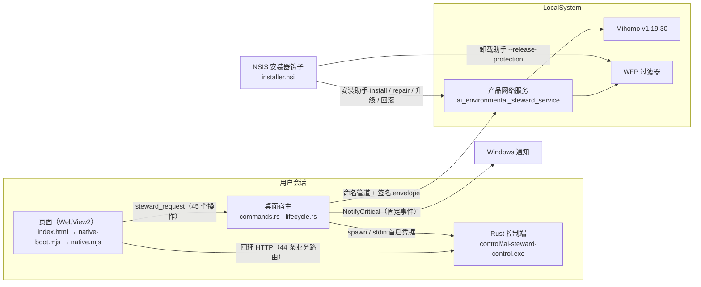

# 发布候选调用链

日期：2026-09-21（RC6）。按当前代码逐段列出调用者、被调用者、所在进程、输入、失败表现、日志位置、离线证据与异机编号。机器可读版本是 [release-readiness.json](release-readiness.json)，由 `node tools/release/release.mjs readiness --write evidence/delivery/release-readiness.json` 从 `tools/release/call-chain.json` 生成；生成时逐个核对调用者与被调用者的文件和符号、离线用例名都真实存在，对不上就拒绝生成。

每一跳标两种状态之一：**离线已走通**（离线用例经真实代码走过）或 **源码在、未编译**（Rust 或 NSIS，只有源码核对）。没有调用者的实现不列入。

## 1. 页面 → Tauri bridge → 宿主受限操作

| 调用者 | 被调用者 | 进程 | 状态 |
|---|---|---|---|
| `apps/desktop-ui/index.html` 加载 `native-boot.mjs` | `native-boot.mjs#bootNativeSteward` | WebView2 | 离线已走通 |
| `native-boot.mjs` 的 `tauri('steward_request', …)` | `commands.rs#steward_request` | WebView2 → 宿主（Tauri IPC） | 源码在、未编译 |
| `commands.rs#steward_request` → `dispatch_logged` | `commands.rs#dispatch` | 宿主 | 源码在、未编译 |

- 输入：`op` 与 `payload`，按 `bridge-contract.mjs` 的 45 个操作、12 个能力组；写操作只带宿主签发的授权引用。
- 失败：未知操作 `NATIVE_OP_UNKNOWN`，缺授权 `NATIVE_AUTHORIZATION_REQUIRED`，越界 `NATIVE_PATH_OUT_OF_SCOPE`；没有桥时页面显示 `UI_BACKEND_NOT_ATTACHED`。
- 日志：`<数据根>\logs\app-*.log`，每个失败的原生操作一行（操作名与错误码）。
- 离线证据：`native-chain.test.mjs` 的契约与正式启动用例；`journeys.test.mjs` 的桥接契约；`release-candidate.test.mjs` 的 R14（页面按浏览器方式加载整张模块图）。
- 异机：E01、E02、E32。

## 2. 宿主 → Rust 控制端进程 → 44 条业务路由

| 调用者 | 被调用者 | 进程 | 状态 |
|---|---|---|---|
| `lib.rs` setup 里 `control.start()` | `control_process.rs#ControlSupervisor::start` | 宿主后台线程 | 源码在、未编译 |
| `host.rs#control_mode` 定位 `<安装目录>\control\ai-steward-control.exe` | `services/control-rs/src/main.rs#main` | 宿主启动的子进程 | 源码在、未编译 |
| `product-runtime.mjs` 的 `createHttpControlPort` | `router.rs#ROUTES`（44 条） | 页面 → 回环 HTTP → 控制端 | 源码在、未编译 |

- 输入：资源目录里的控制端程序，经 stdin 交付的一次性首启凭据，控制端 stdout 回报的监听地址与 `/health` 握手。
- 失败：握手失败或超时时 `ControlStatus` 为 failed 并带错误码；退出界面时宿主只停自己启动的子进程。
- 日志：`host-control-*.log`、`control\logs\control-*.log`。
- 离线证据：`tests/control-runtime` 的首启登录、管理旅程与探测服务用例（按契约替身）。
- 异机：E01、E31、E47。

## 3. 页面网络端口 → 宿主签名 IPC → 产品网络服务 → Mihomo/WFP

| 调用者 | 被调用者 | 进程 | 状态 |
|---|---|---|---|
| `nativePorts.mjs` 的 `invoke('ApplyNetworkPlan', …)` | `network_runtime.rs#apply_network_plan` | 页面 → 宿主 | 源码在、未编译 |
| `network_runtime.rs` 的 `state.network.write(…)` | 服务 `server.rs#serve_connection` | 宿主 → 命名管道 → LocalSystem 服务 | 源码在、未编译 |
| 服务 `network/mod.rs` 的 `apply_config` | `manager.rs#spawn_core` | 服务 → Mihomo 子进程 | 源码在、未编译 |
| 服务的保护后端 | `wfp.rs#product_protection` | 服务 → WFP | 源码在、未编译 |

- 输入：页面编译的受管配置、宿主写的草稿与签名 envelope、预授权保护引用。
- 失败：配置阶段逐项呈现，回读不通过就恢复 last-valid；保护未确认不放行；服务不可达时显示 `SERVICE_UNREACHABLE`。
- 日志：`%ProgramData%\ai-environmental-steward-service\logs\service*.log`、`core*.log`。
- 离线证据：`tests/network/rc3-runtime.test.mjs` 与 `loopback-endpoints.test.mjs`（服务契约替身）。
- 异机：E17、E21、E39、E40—E42。

## 4. 日志/计数 → RC5 审计运行时 → 归档/日报/导出

| 调用者 | 被调用者 | 进程 | 状态 |
|---|---|---|---|
| `native.mjs` 的 `createAuditRuntime` | `src/adapters/audit/runtime.mjs` | 页面 | 离线已走通 |
| 运行时每拍 `network.observeLive` | `src/core/network/controller.mjs#observeLive` → `ReadNetworkState` → 服务 `ObserveRuntime` | 页面 → 宿主 → 服务 | 页面侧离线已走通，宿主与服务源码在、未编译 |
| `serviceLogs.mjs` 的 `LogRead` | `logs.rs#log_read` | 页面 → 宿主 | 源码在、未编译 |
| 运行时的 `archiveLogs` | `src/core/audit/archive.mjs#archiveLogs` | 页面 | 离线已走通 |
| `native.mjs` 的 `invoke('NotifyCritical', …)` | `lifecycle.rs#notify_critical` | 页面 → 宿主 → Windows 通知 | 源码在、未编译 |
| `diagnosticExport.mjs` 的 `LogExportWrite` | `logs.rs#export_write` | 页面 → 宿主 | 源码在、未编译 |

- 输入：内核连接快照与累计计数、日志尾巴与 `core.log` 快照、服务端额度快照。
- 失败：读不到就记缺口，不判连续；写盘失败显示没能保存并重试；系统通知弹不出记失败、危急横幅保留。
- 日志：`app-*.log` 里的 `monitor.*`、`audit.*`；运行记录在 `workspace\audit\runs\`。
- 离线证据：`audit-runtime.test.mjs` 的 RC5、RC5 Round 2 与 RC6 通知用例；`journeys.test.mjs` 的 RC6 页面旅程。
- 异机：E48—E53。

## 5. 安装器 → 服务/控制端/资源落点 → 启动与卸载入口

| 调用者 | 被调用者 | 进程 | 状态 |
|---|---|---|---|
| `tools/release/release.mjs assemble` | `tools/release/assemble.mjs#assembleRelease` | 构建机 Node | 离线已走通（合成目录） |
| `tauri.conf.json` 的 `installerHooks` | `installer.nsi` 的四个钩子 | NSIS（管理员） | 源码在、未执行 |
| `installer.nsi` 的 `--action install/repair/prepare-upgrade/complete-upgrade/rollback-upgrade` | `install_service.rs` | NSIS → 安装助手 | 源码在、未编译 |
| `install_service.rs` 的 `create_service` | `service.rs#main` | 服务控制管理器 → LocalSystem 服务 | 源码在、未编译 |
| `tauri.conf.json` 资源 `control/ai-steward-control.exe` | `host.rs#control_mode` | 安装目录 → 宿主 | 源码在、未编译 |
| `installer.nsi` 的 `NSIS_HOOK_PREUNINSTALL` | `uninstall_service.rs#uninstall` | NSIS 卸载器 → 卸载助手 | 源码在、未编译 |

- 输入：装配目录 `build\release-staging\`；安装时的宿主路径；安装助手按安装器所在桌面会话取得的用户 SID 与配置文件目录（网络状态根由它推出）。
- 失败：桌面程序不让关、保护未确认、备份不成或服务停不下来，就在停服务之前中止安装，现有版本照常运行。服务停下之后，修复或升级失败、`.onInstFailed`（模板的应用检查被取消、文件写不进后取消）与下次运行发现未提交的标记，都由 `StewardRollback` 回到旧版：安装助手 `stop-for-rollback` 停服务，安装器把当前目录改名挪开、放回副本、写回卸载项旧版本号，旧版安装助手 `rollback-upgrade` 放回服务状态并启动旧服务；它退出码为 0 才删安装目录旁边的标记 `<安装目录>.rollback.ini`，否则下次运行只重做这一段。卸载时枚举本产品 WFP 子层清扫（放行删净才删阻断）并复核为零，再把已保存的保护请求作废，然后才删服务；服务停不下来、清扫不干净或作废写不进就中止卸载，服务重启保持管理。
- 日志：`installer-*.log`、`install-*.log`（服务日志目录）；构建机 `build\logs\<时间>-<进程号>\`。
- 离线证据：`release-candidate.test.mjs` 的 R02、R03（装配）、R08（配置与钩子静态核对）、RC6 Round 2 的 F1—F4（整份回滚、会话用户、卸载顺序、必需工具）、Round 3 的 G1—G3（配置文件目录类型、失败出口、子层清扫，G2 对照 `evidence/development/rc6-round3/upstream-tauri-2.11.5/installer.nsi`）与 Round 4 的 H1—H3（回滚标记寿命、保护请求作废、放行先删净）。
- 异机：E54、E55、E56、E58。

## 生命周期（不在五段之内，单列）

托盘、单实例与关窗进托盘都在宿主进程内：`lib.rs#run` 第一个注册单实例插件，回调只调用 `lifecycle.rs#show_main_window`；`CloseRequested` 拦截后隐藏并由 `lifecycle.rs#announce_background` 提示一次；托盘菜单由 `lifecycle.rs#build_tray` 建，三项动作见 `lifecycle.rs#tray_action`；退出界面只 `app.exit(0)`，退出事件里只停托管控制端。全部源码在、未编译，离线只有 `release-candidate.test.mjs` R06、R07 的源码静态核对；异机 E53。
